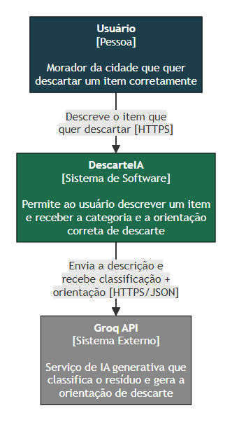

# DescarteIA

## ODS escolhido

**ODS 12 - Consumo e Produção Responsáveis**

Escolhemos esse ODS porque ele fala sobre reduzir o desperdício e melhorar a
forma como a gente descarta o que produz. É basicamente o problema que o
nosso app resolve: ajudar as pessoas a descartar o lixo do jeito certo, sem
contaminar o que poderia ser reciclado.

## O problema

Muita gente não sabe onde jogar cada tipo de lixo. Pilha, eletrônico, óleo de
cozinha, isopor, papelão sujo de comida - cada coisa tem um jeito certo de
descartar, mas a informação é difícil de achar na hora (geralmente só existe
em site de prefeitura, ou espalhada em vários lugares diferentes).

Isso causa alguns problemas:
- Lixo reciclável se mistura com lixo comum e estraga o lote inteiro.
- Coisas perigosas, como pilha e remédio vencido, acabam poluindo o solo e a
  água.
- As pessoas até têm boa vontade de descartar certo, mas desistem porque é
  complicado descobrir como.

## A solução

O usuário descreve o item que quer jogar fora, a IA identifica o tipo de
resíduo e explica onde e como descartar certinho. O app guarda um histórico
do que já foi consultado.

## Como funciona

1. O usuário digita o que quer descartar (ex: "pilha usada").
2. O app manda essa descrição pro backend, que chama a API do Groq.
3. A IA devolve a categoria, se é reciclável, a instrução de descarte e uma
   dica.
4. O usuário pode salvar esse resultado no histórico e consultar depois.

## Tecnologia

- Front-end em React.
- Backend em Python (FastAPI), que guarda a chave da IA e o histórico. Antes
  o front chamava a IA direto do navegador - isso expunha a chave, então
  movemos essa parte pro backend.
- IA: API do Groq (free tier, sem cartão de crédito).
- Banco: SQLite, só a tabela de histórico.

## Diagramas

[C4 nível 1](docs/c4-nivel1-contexto.md) · [C4 nível 2](docs/c4-nivel2-container.md) · [Classes](docs/diagrama-classes.md) · [Banco de dados](docs/diagrama-banco-de-dados.md) · [Casos de uso](docs/diagrama-casos-de-uso.md) · [Sequência](docs/diagrama-sequencia.md)



## Público-alvo

- Pessoas que não sabem separar o lixo direito no dia a dia.
- Estudantes e famílias que querem ajudar o meio ambiente mas não têm essa
  informação na mão.
- Condomínios que querem melhorar a coleta seletiva do prédio.
- Cooperativas de reciclagem, que passam a receber material mais limpo e
  separado.

## Como rodar

### Backend

```bash
cd backend
python -m venv .venv
.venv\Scripts\activate        # Windows
# source .venv/bin/activate   # Linux/Mac
pip install -r requirements.txt
copy .env.example .env        # Windows
# cp .env.example .env        # Linux/Mac
```

Abre o `.env` e preenche `GROQ_API_KEY` com uma chave gratuita (gera em
console.groq.com/keys).

```bash
uvicorn app.main:app --reload
```

Sobe em `http://localhost:8000`.

### Frontend

```bash
cd frontend/preview
python serve.py
```

Abre `http://localhost:8765/preview/index.html`. Se o backend estiver em
outro endereço, troca em `frontend/preview/index.html`
(`window.DESCARTEIA_API_URL`).

Instruções mais detalhadas, com troubleshooting, em
[`backend/README.md`](backend/README.md).

## Equipe

| Nome | Responsabilidade |
|---|---|
| Gabriel | Arquitetura e integração com IA |
| Arthur | Front-end |
| Nayslon | Backend |
| João Pedro | Modelagem de dados |
| Renato | Conteúdo e regras de descarte |
| Larissa | UX/UI |
| Roberthy | Documentação e testes |
