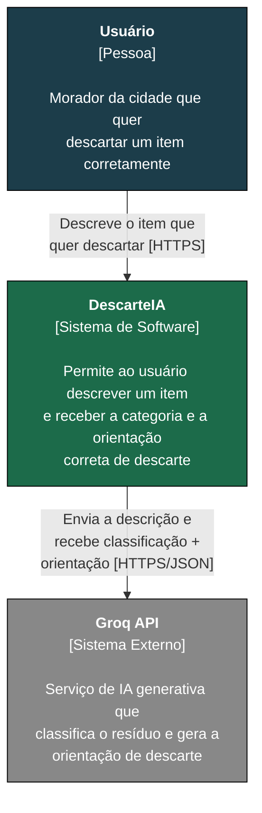

# C4 Nível 1 - Contexto

```mermaid
flowchart TB
    Usuario["<b>Usuário</b><br/>[Pessoa]<br/><br/>Morador da cidade que quer<br/>descartar um item corretamente"]
    Sistema["<b>DescarteIA</b><br/>[Sistema de Software]<br/><br/>Permite ao usuário descrever um item<br/>e receber a categoria e a orientação<br/>correta de descarte"]
    Groq["<b>Groq API</b><br/>[Sistema Externo]<br/><br/>Serviço de IA generativa que<br/>classifica o resíduo e gera a<br/>orientação de descarte"]

    Usuario -->|"Descreve o item que<br/>quer descartar [HTTPS]"| Sistema
    Sistema -->|"Envia a descrição e<br/>recebe classificação +<br/>orientação [HTTPS/JSON]"| Groq

    classDef pessoa fill:#1C3D4A,color:#fff,stroke:#000
    classDef sistema fill:#1C6B4A,color:#fff,stroke:#000
    classDef externo fill:#888,color:#fff,stroke:#000
    class Usuario pessoa
    class Sistema sistema
    class Groq externo
```
