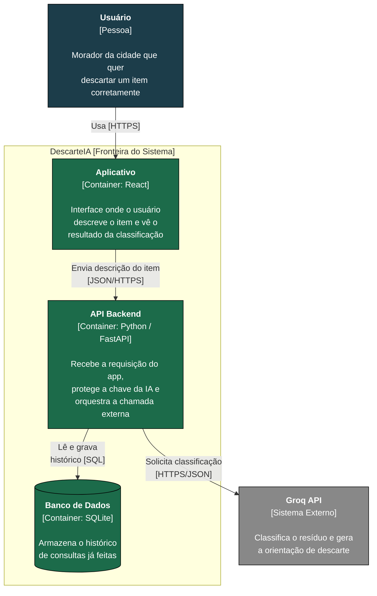

# C4 Nível 2 - Contêineres

```mermaid
flowchart TB
    Usuario["<b>Usuário</b><br/>[Pessoa]<br/><br/>Morador da cidade que quer<br/>descartar um item corretamente"]

    subgraph Sistema["DescarteIA [Fronteira do Sistema]"]
        Front["<b>Aplicativo</b><br/>[Container: React]<br/><br/>Interface onde o usuário<br/>descreve o item e vê o<br/>resultado da classificação"]
        Back["<b>API Backend</b><br/>[Container: Python / FastAPI]<br/><br/>Recebe a requisição do app,<br/>protege a chave da IA e<br/>orquestra a chamada externa"]
        DB[("<b>Banco de Dados</b><br/>[Container: SQLite]<br/><br/>Armazena o histórico<br/>de consultas já feitas")]
    end

    Groq["<b>Groq API</b><br/>[Sistema Externo]<br/><br/>Classifica o resíduo e gera<br/>a orientação de descarte"]

    Usuario -->|"Usa [HTTPS]"| Front
    Front -->|"Envia descrição do item<br/>[JSON/HTTPS]"| Back
    Back -->|"Lê e grava<br/>histórico [SQL]"| DB
    Back -->|"Solicita classificação<br/>[HTTPS/JSON]"| Groq

    classDef pessoa fill:#1C3D4A,color:#fff,stroke:#000
    classDef container fill:#1C6B4A,color:#fff,stroke:#000
    classDef externo fill:#888,color:#fff,stroke:#000
    class Usuario pessoa
    class Front,Back,DB container
    class Groq externo
```
