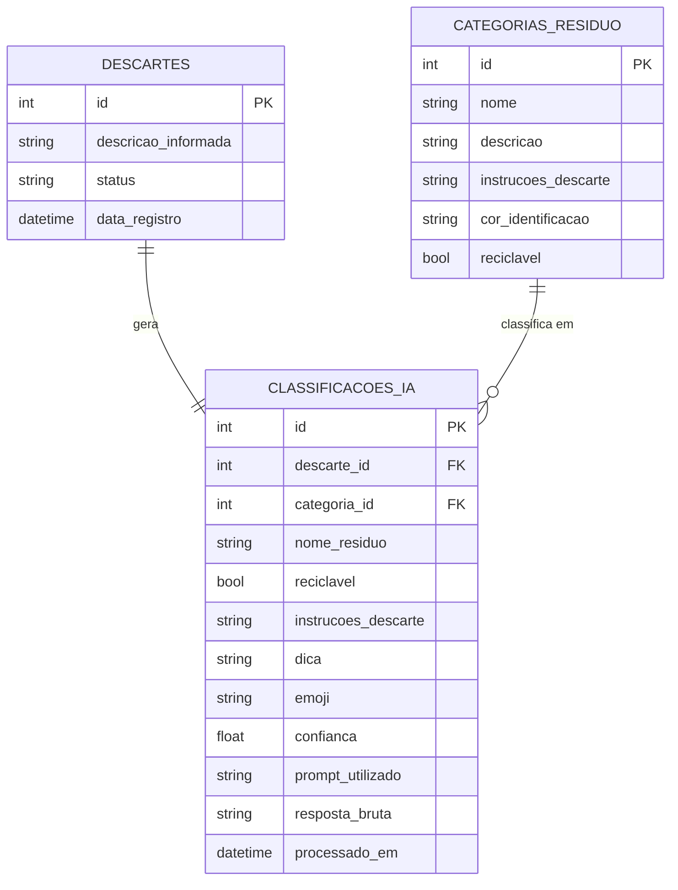

# Diagrama do Banco de Dados - DescarteIA

MER das tabelas usadas no backend (SQLite via SQLAlchemy).

`categoria_id` só fica nulo se a IA responder com um nome de categoria que não
existe na tabela `categorias_residuo` (não deveria acontecer, já que o prompt
lista as categorias válidas, mas o código trata esse caso). `confianca` sempre
fica nulo porque a API do Gemini não retorna esse valor.
