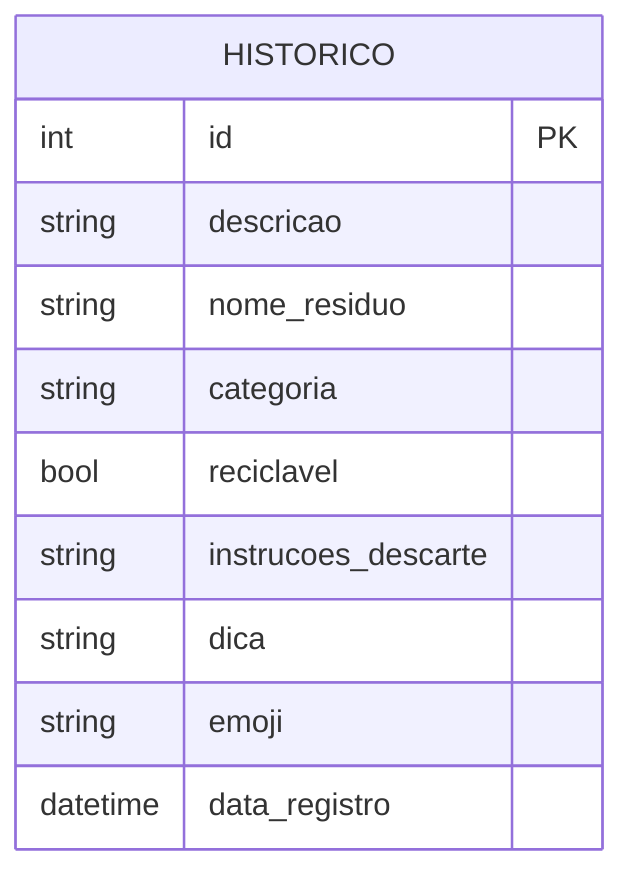

# Diagrama do Banco de Dados - DescarteIA

Uma tabela só, sem relacionamento com outra tabela.

`categoria` é salva como texto (um dos 16 valores da enumeração `Categoria`),
não como uma tabela separada - não tem necessidade de gerenciar categorias
dinamicamente, elas são fixas no código.
