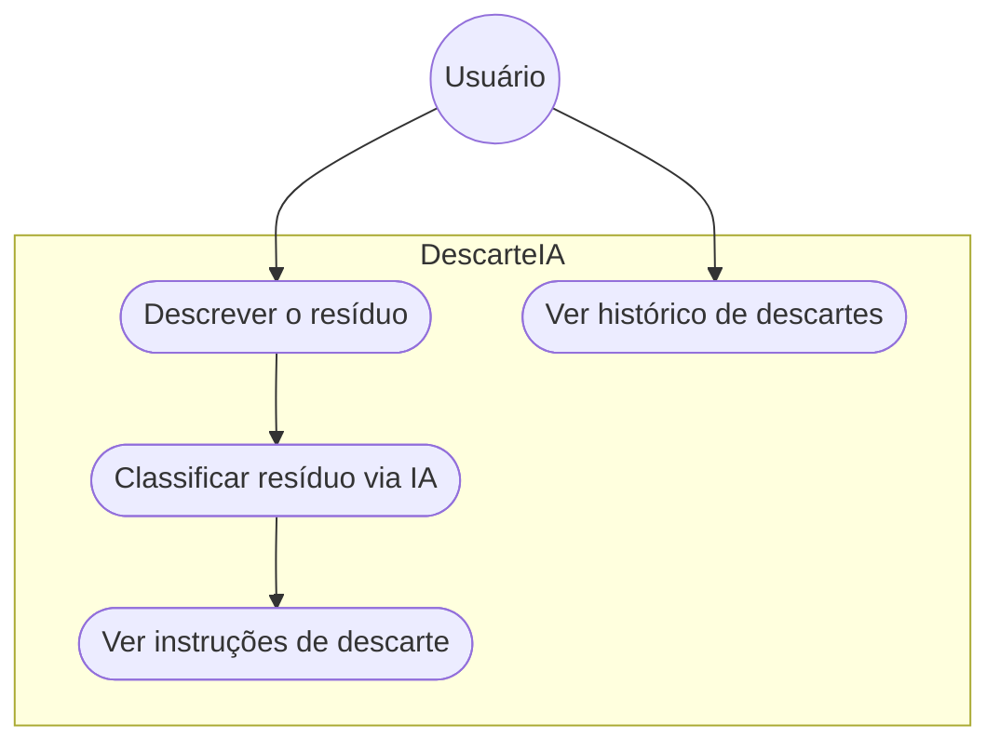

# Diagrama de Casos de Uso - DescarteIA

| Caso de uso | Ator | Descrição |
|---|---|---|
| Descrever o resíduo | Usuário | Digita o que quer descartar (sem foto, só texto) |
| Classificar resíduo via IA | Sistema | Usa a API do Gemini para identificar a categoria |
| Ver instruções de descarte | Usuário | Recebe orientação de como descartar corretamente |
| Ver histórico de descartes | Usuário | Consulta descartes já feitos (salvo no navegador, local) |

Login, cadastro de usuário, pontos de coleta e um painel de admin para gerenciar
categorias estavam no documento de visão inicial, mas não entraram no escopo
desta entrega - foi definido como 2-3 funcionalidades essenciais pra entrega 3.
