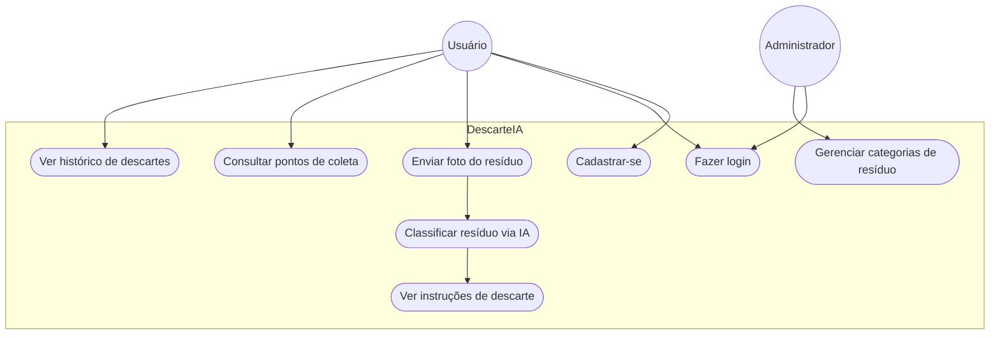

# Diagrama de Casos de Uso — DescarteIA

## Descrição resumida dos casos de uso

| Caso de Uso | Ator | Descrição |
|---|---|---|
| Cadastrar-se | Usuário | Cria uma conta no aplicativo |
| Fazer login | Usuário / Admin | Autentica-se no sistema |
| Enviar foto do resíduo | Usuário | Envia imagem/descrição do item a ser descartado |
| Classificar resíduo via IA | Sistema | Usa a API da Anthropic para identificar a categoria |
| Ver instruções de descarte | Usuário | Recebe orientação de como descartar corretamente |
| Consultar pontos de coleta | Usuário | Vê locais próximos que aceitam aquele tipo de resíduo |
| Ver histórico de descartes | Usuário | Consulta descartes já registrados |
| Gerenciar categorias de resíduo | Administrador | Cadastra/edita categorias e instruções |
