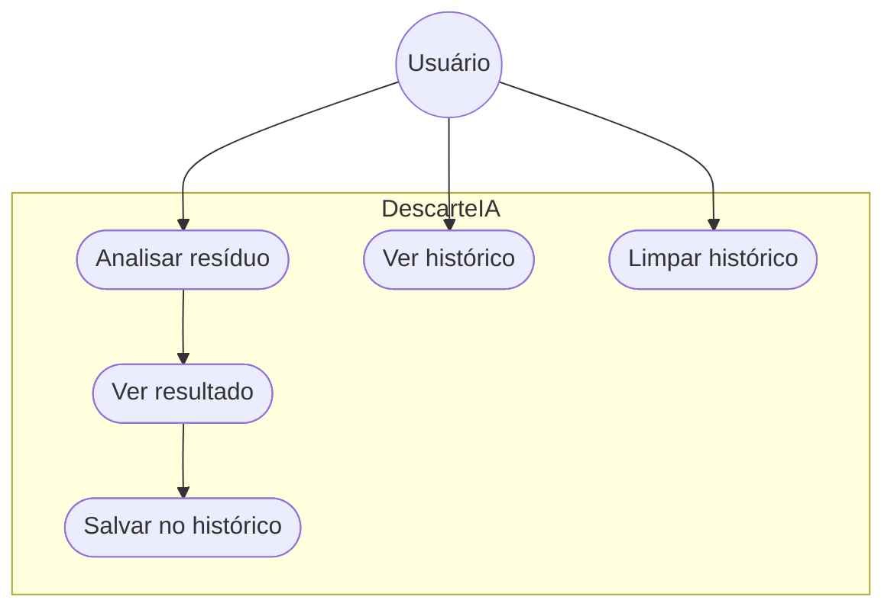

# Diagrama de Casos de Uso - DescarteIA

| Caso de uso | Descrição |
|---|---|
| Analisar resíduo | Descreve em texto o que quer descartar e manda pro backend classificar |
| Ver resultado | Backend devolve categoria, se é reciclável, instruções e uma dica |
| Salvar no histórico | Guarda esse resultado no backend |
| Ver histórico | Lista os resultados já salvos |
| Limpar histórico | Apaga tudo o que foi salvo |

Login, cadastro de usuário, pontos de coleta e um painel de admin pra
categorias estavam no documento de visão inicial, mas não entraram no escopo
até agora.
