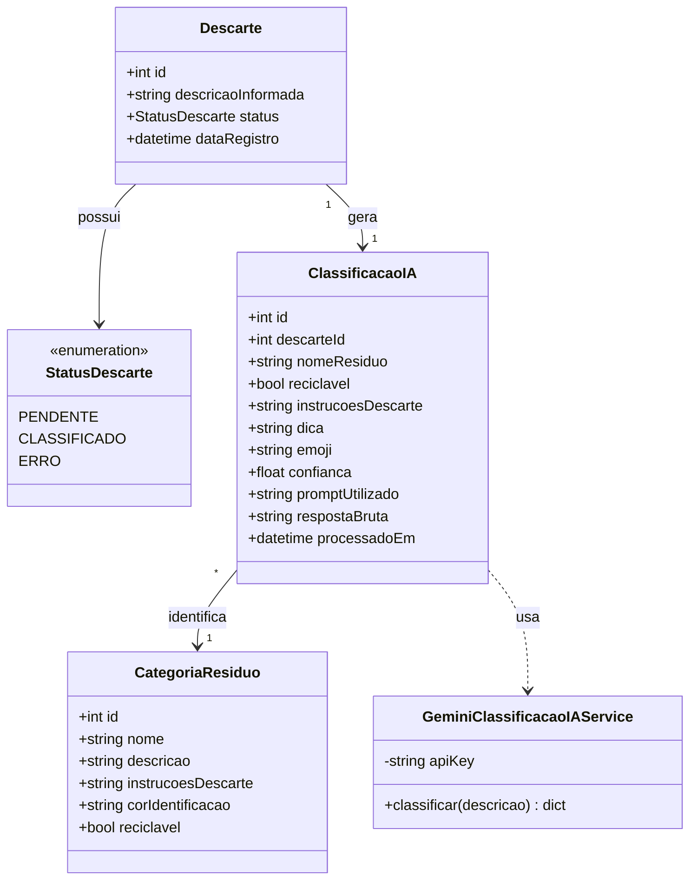

# Diagrama de Classes — DescarteIA

Reflete o que está implementado no backend até a Entrega 3.

`Usuario` e `PontoColeta`, que apareciam na versão inicial deste diagrama (documento de visão), ainda não foram implementados — ficam para uma próxima entrega, quando o app tiver cadastro de usuário e busca por local de coleta.
