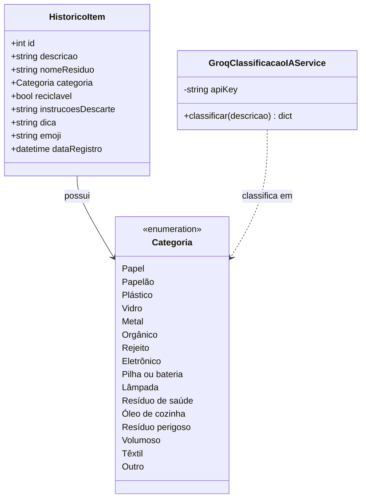

# Diagrama de Classes - DescarteIA

Reflete o backend real do projeto.

```mermaid
classDiagram
    class HistoricoItem {
        +int id
        +string descricao
        +string nomeResiduo
        +Categoria categoria
        +bool reciclavel
        +string instrucoesDescarte
        +string dica
        +string emoji
        +datetime dataRegistro
    }

    class Categoria {
        <<enumeration>>
        Papel
        Papelão
        Plástico
        Vidro
        Metal
        Orgânico
        Rejeito
        Eletrônico
        Pilha ou bateria
        Lâmpada
        Resíduo de saúde
        Óleo de cozinha
        Resíduo perigoso
        Volumoso
        Têxtil
        Outro
    }

    class GroqClassificacaoIAService {
        -string apiKey
        +classificar(descricao) dict
    }

    HistoricoItem --> Categoria : possui
    GroqClassificacaoIAService ..> Categoria : classifica em
```

`Usuario` e `PontoColeta`, do documento de visão inicial, não entraram no
escopo até agora.
