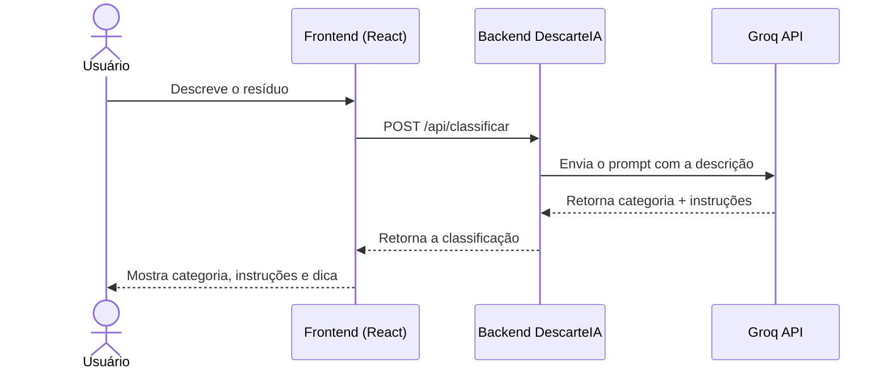
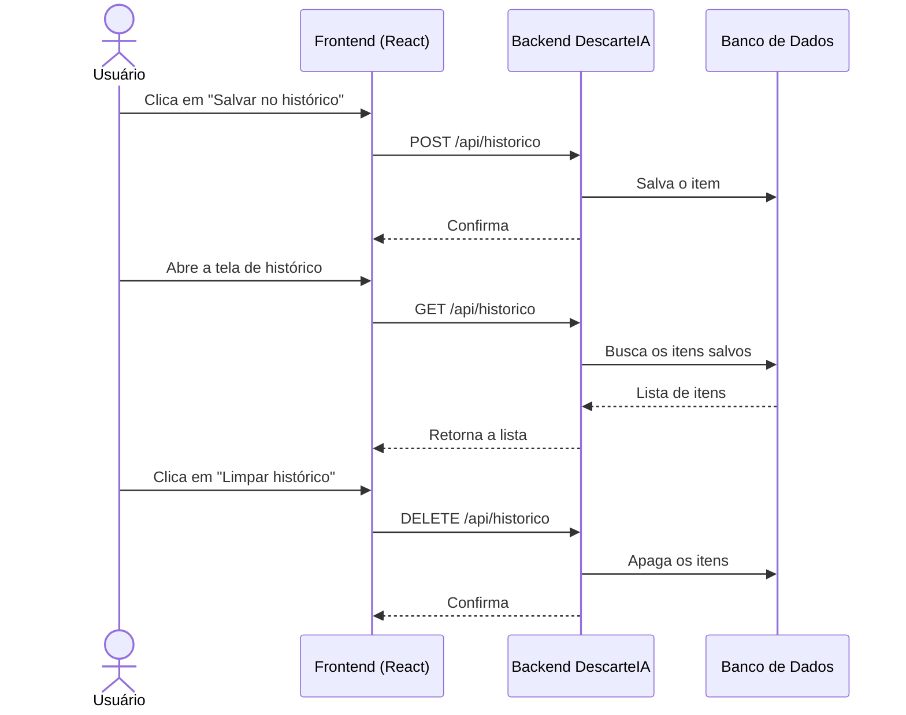

# Diagramas de Sequência - DescarteIA

## Analisar um resíduo

```mermaid
sequenceDiagram
    actor U as Usuário
    participant App as Frontend (React)
    participant API as Backend DescarteIA
    participant IA as Groq API

    U->>App: Descreve o resíduo
    App->>API: POST /api/classificar
    API->>IA: Envia o prompt com a descrição
    IA-->>API: Retorna categoria + instruções
    API-->>App: Retorna a classificação
    App-->>U: Mostra categoria, instruções e dica
```

## Histórico

```mermaid
sequenceDiagram
    actor U as Usuário
    participant App as Frontend (React)
    participant API as Backend DescarteIA
    participant DB as Banco de Dados

    U->>App: Clica em "Salvar no histórico"
    App->>API: POST /api/historico
    API->>DB: Salva o item
    API-->>App: Confirma

    U->>App: Abre a tela de histórico
    App->>API: GET /api/historico
    API->>DB: Busca os itens salvos
    DB-->>API: Lista de itens
    API-->>App: Retorna a lista

    U->>App: Clica em "Limpar histórico"
    App->>API: DELETE /api/historico
    API->>DB: Apaga os itens
    API-->>App: Confirma
```
