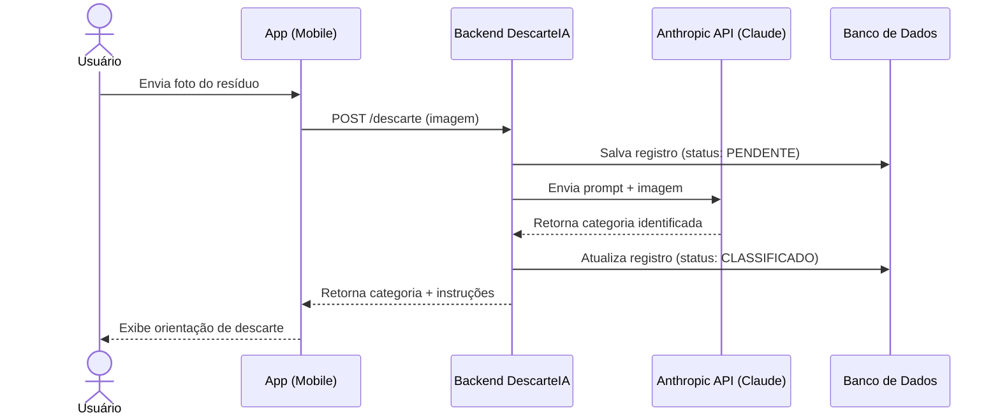

# Diagrama de Sequência — Classificação de Resíduo via IA

Fluxo do momento em que o usuário envia uma foto e o sistema retorna a orientação de descarte.

```mermaid
sequenceDiagram
    actor U as Usuário
    participant App as App (Mobile)
    participant API as Backend DescarteIA
    participant IA as Anthropic API (Claude)
    participant DB as Banco de Dados

    U->>App: Envia foto do resíduo
    App->>API: POST /descarte (imagem)
    API->>DB: Salva registro (status: PENDENTE)
    API->>IA: Envia prompt + imagem
    IA-->>API: Retorna categoria identificada
    API->>DB: Atualiza registro (status: CLASSIFICADO)
    API-->>App: Retorna categoria + instruções
    App-->>U: Exibe orientação de descarte
```
