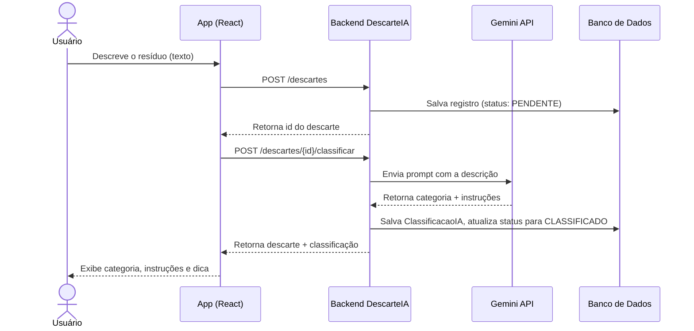

# Diagrama de Sequência - Classificação de Resíduo via IA

Fluxo do momento em que o usuário descreve o item e o sistema devolve a orientação de descarte.

```mermaid
sequenceDiagram
    actor U as Usuário
    participant App as App (React)
    participant API as Backend DescarteIA
    participant IA as Gemini API
    participant DB as Banco de Dados

    U->>App: Descreve o resíduo (texto)
    App->>API: POST /descartes
    API->>DB: Salva registro (status: PENDENTE)
    API-->>App: Retorna id do descarte

    App->>API: POST /descartes/{id}/classificar
    API->>IA: Envia prompt com a descrição
    IA-->>API: Retorna categoria + instruções
    API->>DB: Salva ClassificacaoIA, atualiza status para CLASSIFICADO
    API-->>App: Retorna descarte + classificação
    App-->>U: Exibe categoria, instruções e dica
```
